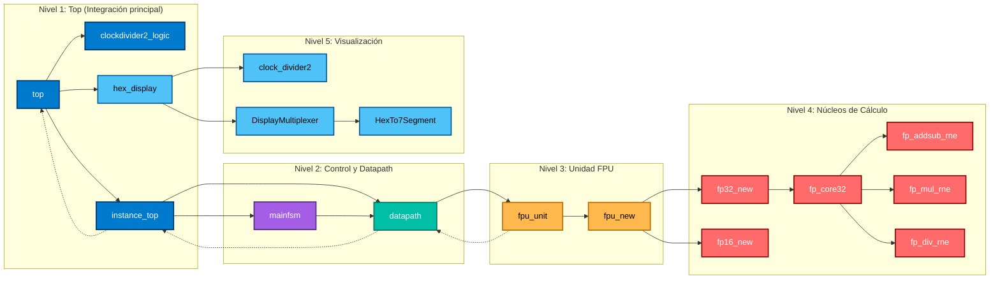

# 🧮 Proyecto FPU – Datapath y Control en Verilog

Este proyecto implementa una **unidad de procesamiento en punto flotante (FPU)** con soporte para operaciones **FP32 y FP16**, integrando control secuencial, datapath, y visualización en displays de 7 segmentos.  
La arquitectura está pensada para funcionar en una **placa Basys3**, y combina módulos de control (`mainfsm`), cómputo (`datapath` y `fpu_unit`) y salida visual (`hex_display`).

---

## ⚙️ Diagrama de Arquitectura

---

## 🔁 Flujo General del Sistema

1. **Entrada (`entry`)**: el usuario introduce el dato u operación a ejecutar.  
2. **FSM (`mainfsm`)**: interpreta el opcode y genera las señales de control (habilitación, selección de resultado, etc.).  
3. **Datapath (`datapath`)**: enruta los operandos, registra los valores intermedios y activa la **FPU**.  
4. **Unidad FPU (`fpu_unit` / `fpu_new`)**: selecciona entre precisión **FP16 o FP32**, y ejecuta la operación indicada (add, sub, mul o div).  
5. **Salida (`hex_display`)**: muestra el resultado final en los **4 displays de 7 segmentos**, actualizando cada dígito mediante multiplexado.

---

## 🧩 Componentes Principales

| Nivel | Módulo | Descripción breve |
|-------|---------|-------------------|
| 🏗️ Nivel 1 | **top** | Integra reloj, núcleo de cómputo y display. |
| 🧠 Nivel 2 | **mainfsm** | Controla el flujo de estados y señales de habilitación. |
| 🔧 Nivel 2 | **datapath** | Maneja registros, multiplexores y conexión a la FPU. |
| 🔬 Nivel 3 | **fpu_unit** | Decodifica el opcode y selecciona precisión FP16/FP32. |
| ⚙️ Nivel 4 | **fpu_new** | Encapsula los módulos `fp32_new` y `fp16_new`. |
| 💡 Nivel 5 | **hex_display** | Controla el reloj lento y muestra resultados en 7 segmentos. |

